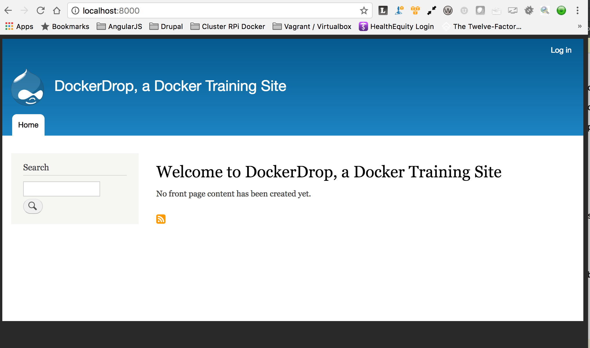

Lesson 8:  Add a Drupal Installation and commit your project to Github
======================================================================

Now that we have our Makefile in place, we can use the `init:` target to download a Drupal project and supporting files to configure a Drupal 8 site within our project.

The Codebase and config files reside in Github repos, while the starting seed database, drupal config files (settings.php and related files) and the Travis config file are on an Amazon S3 instance.

Our Makefile target has scripted instructions to pull all of the necessary components to install our sample Drupal site into our project.

1: Run the Make target to install Drupal
########################################

Execute `make init`.

This will execute commands that will:

* Pull the drupal codebase and configuration files from the sample repositories
* Download several files from AWS and put them in the appropriate places
* Bring up the containers, and import the database
* Execute several composer commands to fiinish setting up our Drupal 8 project and our Behat tests
* Will run several drush commands (updatedb, entityupdate, feature revert all, and clear the caches)

When these commands are complete, you should have a working Drupal site and a basic Behat test suite.

2: Verify that your Drupal site installation completed successfully
###################################################################

Pull up `http://localhost:8000`, and you should see:

3: Look at the settings.local.php file
######################################

Let's take a look at the settings.local.php file for a minute:

.. code-block:: php
   :linenos:
   :emphasize-lines: 3-5, 7, 18, 20

    <?php
    $databases['default']['default'] = array (
      'database' => 'drupal',
      'username' => 'drupal',
      'password' => 'drupal',
      'prefix' => '',
      'host' => 'db',
      'port' => '3306',
      'namespace' => 'Drupal\\Core\\Database\\Driver\\mysql',
      'driver' => 'mysql',
    );
    $settings['install_profile'] = 'standard';
    $config_directories = array(
      CONFIG_SYNC_DIRECTORY => '../config/sync',
    );
    $settings['trusted_host_patterns'] = array(
      '^localhost$',
      '^web$'
    );
    $base_url = 'http://localhost:8000';

Several of the hightlighted lines are sigificant.  The database, username and password match the php service's environment variables we set in our `docker-compose.yml` file.

Note that the 'host' is not `localhost`, but is instead declared as `db`, which is the name of our database service running our database application.

Drupal 8 requires that you set trusted host patterns for the hostnames you will be using to access the site.  Our config file has two:

* "localhost", which is the hostname we're using to pull the site up in our browser
* "web", which is the name of the service running our web server, NginX.  This will be the domain name that Behat will use to access the site over the local docker network.

Finally, the $base_url is set to our external hostname and port, so that commands such as "drush uli" will return an appropriately qualified url.

4:  Commit your project to Github
#################################

Go ahead and add this project to Github.  We will need our codebase on Github to finish configuring Travis as well as to be able to commit our container images to Docker Hub.

Make a project in your account named "dockerdrop" and commit all of the files in your project directory not specifically excluded by .gitignore to Github.  Make sure you commit your project on the "develop" branch.

