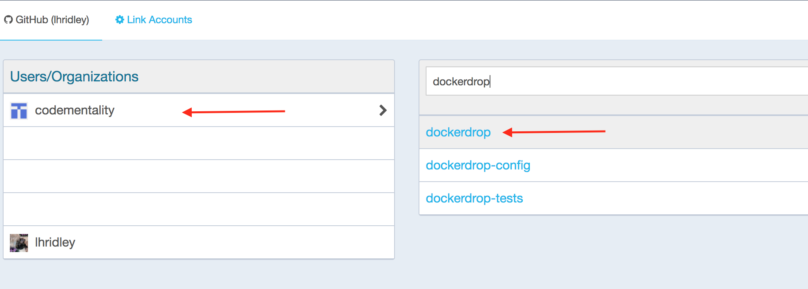

Lesson 9:  Put your Images on Docker Hub
========================================

Now that we've got our code committed to Github, let's look at setting up some image repositories on Docker Hub.

With an image repository, we can utilize pre-built images instead of building an image from a Dockerfile each time we initialize an environment.  Granted, images are cached in our local image cache and will need to be rebuilt only when the image changes.  However, Travis doesn't cache images locally since each testing environment is virtualized, and destroyed after each testing session is complete.  So, to speed up Travis and to ensure that team members are all working from the same set of images, you can host images on Docker Hub, and reference the hosted images in your `docker-compose.yml` file, and Docker will pull those images rather than build them from a Dockerfile.

We will be creating two repositories on Docker Hub to house our custom Docker image files:  one for the PHP image and one for the NginX image.

1:  Create a repository on Docker Hub
#####################################

Log into Docker Hub, select "Create" from the menu in the upper right, then pick "Create Automated Build" from the dropdown:

Click "Create Autobuild Github" on the left hand side of the screen...

Select your user account from Github on the left, and filter your repositories until you find the "dockerdrop" Github Repo on your right...

Click on the "dockerdrop" repo on your right, and you will be taken to the "Create Automated Build" screen.

The repository namespace on the left is your Docker Hub account where this repository will be housed.  The repository name on the right will be the name of this image repository on Docker Hub.

Change the repository name to "dockerdrop-php", and click the "create" button on the lower right...

Your repository will be created, and will be linked to your Github source code repository.  You will see a screen similar to the following:

Your image repository has been created with the name <githubaccount>/dockerdrop-php, and it's linked to your Github source respository.  The link to the Github repo is on the lower right.

2:  Configure your Build Settings
#################################

Click on "Build Settings" in the menu below the image repository name. You'll be taken to a page that looks similar to this:

Docker Image repositories that are set up as Autobuild repos can be tied to Github to build on Branches or on Tags, and these build rules can be set up as strings, or as regex expressions.

Regex expressions are useful when you have an ongoing project that has images that are regularly versioned and have tagged releases.  A rule can be set up to trigger an automated build every time a new tag is created on Github that matches the regex string of the rule on Docker Hub.

We're going to use the "Branch" option to set up our automated build rule.

Select "Branch" from the "Type" field, change the Name field to "develop", and change the "Dockerfile location" to "/develop/php/", which is the location of the Dockerfile in our Github repo.  Leave the "Docker Tag Name" as "latest".

Click the red "-" on the next line down to remove the second rule.  Your screens should look similar to this:

Click "Save Changes".  When your rules have been saved (the "Save Changes" button will change colors, say "Save" and then change back), click the "trigger" button to the right of your rule.  This will trigger the initial build.

Builds get queued up and are usually completed within 10-15 minutes, depending on the complexity of the build and the number of queued jobs ahead of you in the queue.  If you click on "Build Details", you will see the status of your build.

Your status can be "Queued", "Building", "Success" or "Failed".  If your status is "Failed", there will be information in the build log to help you diagnose the problem with your build.

If your account is a paid account, your build will happen faster.

When the build has successfully completed, you will see a new tag for your image repository called "latest" under "Tags", and your image will be ready for use.

Now, let's rinse and repeat for our NginX repository, with the following changes:

* Name your repository "dockerdrop-nginx"
* Use the "develop" branch and the Dockerfile location of "/docker/nginx/"

Your Docker Hub images are now linked to your Github repository, and will automatically rebuild whenever you push changes to the files located in the "develop" branch, in the folder you indicated when you set up your build rule on Docker Hub.

3:  Change your `docker-compose.yml` file to use your hosted Docker Hub images
##############################################################################

Edit your `docker-compose.yml` file.  Under the "web" service tag, remove the following:

.. code-block:: yaml
   :linenos:

    build: ./docker/nginx/

and replace it with:

.. code-block:: yaml
   :linenos:

    image: dockerdrop/dockerdrop-nginx:latest

Use your repository's namespace in place of "dockerdrop" to the left of the forward slash.

Do the same for the php service, only use the "dockerdrop-php:latest" repo name instead for the image name.

Save your docker compose file, which should look as follows:

.. code-block:: yaml
   :linenos:
   :emphasize-lines: 4, 19

    version: '2'
    services:
      web:
        image: dockerdrop/dockerdrop-nginx:latest
        ports:
          - "8000:80"
        volumes:
          - .:/var/www/html
        depends_on:
          - php
        environment:
          #Make this the same for PHP
          NGINX_DOCROOT: www
          NGINX_SERVER_NAME: localhost
          # Set to the same as the PHP_POST_MAX_SIZE, but use lowercase "m"
          NGINX_MAX_BODY_SIZE: 20m

      php:
        image: dockerdrop/dockerdrop-php:latest
        expose:
          - 9000
        volumes:
          - .:/var/www/html
        depends_on:
          - db
        environment:
          PHP_MEMORY_LIMIT: 256M
          PHP_MAX_EXECUTION_TIME: 120
          # If you set this,make sure you also set it for Nginx
          PHP_POST_MAX_SIZE: 20M
          PHP_UPLOAD_MAX_FILESIZE: 20M
          # used by Drush Alias; if not specified Drush defaults to dev
          PHP_SITE_NAME: dev
          # used by Drush alias; if not specified Drush defaults to localhost:8000
          PHP_HOST_NAME: localhost:8000
          # Make this the same for Nginx
          PHP_DOCROOT: www

      db:
        image: mariadb:10.1.21
        environment:
          MYSQL_ROOT_PASSWORD: root
          MYSQL_DATABASE: drupal
          MYSQL_USER: drupal
          MYSQL_PASSWORD: drupal
        command: --character-set-server=utf8mb4 --collation-server=utf8mb4_unicode_ci # The simple way to override the mariadb config.
        volumes:
          - mysql-data:/var/lib/mysql
          - ./data:/docker-entrypoint-initdb.d # Place init .sql file(s) here.

      mailhog:
        image: mailhog/mailhog:latest
        ports:
          - "8002:8025"

      selenium:
        image: selenium/standalone-firefox:2.53.0

    volumes:
      mysql-data:
        driver: local

4: Add a new target to your Makefile
####################################

We want to make sure when we build a new project, or add a new team member to the team, that they are working with the latest image.  In addition, when we push new images we want to make sure that team members refresh their local development environment to work with the latest images for our project.

By default, Docker will pull images from the local cache when you launch an image instance.  Images are only pulled from Docker Hub if the local cache doesn't contain an image that matches the name you specify.

You can instruct Docker to check for new images by passing a request to "pull" images.

Edit your Makefile, and add the following target to the end of your file.

.. code-block:: bash
   :linenos:

    pull-images:
    	docker-compose pull

Then up under the "init" target at the top of the file, insert the line `make pull-images` as the 7th line, right above `docker-compose up -d --build`.

Save your Makefile.

You've just added a new target for convenience that will pull and refresh your image cache by executing `make pull-images`, and a new step to automatically do this when you run `make init`.
