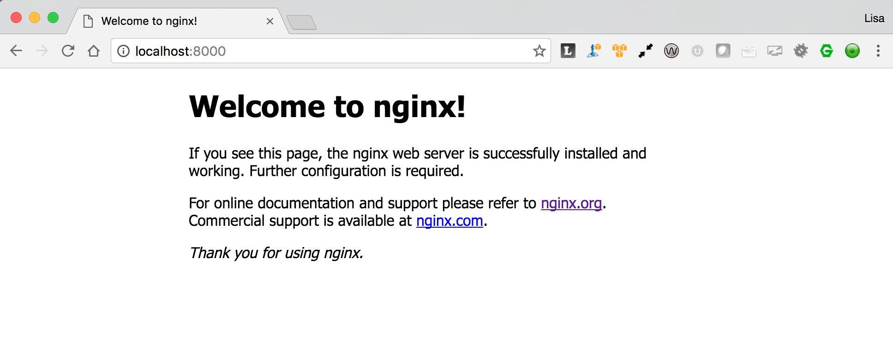

Lesson 1: Set up a web service
==============================

Let's set up our project, called "dockerdrop", by creating a directory to house it named "dockerdrop".

1: Create a Docker Compose yaml file
####################################

Create a file called `docker-compose.yml` in the root of your project directory.

This file will contain all information about the services, networks and volumes that will make up your development environment stack.  As we progress with this project, we will modify this file to modify services, define additional ones, add volumes and configure each volume and service to work together to build a viable development stack for our project.

2:  Designate the Docker Compose file version
#############################################
Add the following to the top of your `docker-compose.yml` file

.. code-block:: yaml

   version: '3'

This key designates which Docker Compose file format version that our `.yml` file is using.  Backwards compatibility has been maintained in docker-compose currently so that earlier versions will work with the current version of Docker Compose, but each version incorporates new features of Docker that weren't available in previous versions.

While backwards compatibility with the file format has been maintained, not all formats work with all versions of Docker; the various `version` key values are tied to specific Docker versions.

If you see a `docker-compose.yml` file without a version key, it is a `version 1` docker-compose file.  This version is considered deprecated.

`Version 2` was the second iteration of the docker-compose.yml file.  It requires that you are running Docker Engine version 1.10.0 or greater.  To designate a `docker-compose.yml` file as compliant with `Version 2`, you must explicitely include this line in your `.yml` file.

The current version of the Docker Compose file format is `version '3'`, with the most recent version being `version '3.7'`.  We will be using `version '3'` in this tutorial.

For more information about the different versions, formats and requirements, please refer to the documentation on https://docs.docker.com located at `https://docs.docker.com/compose/compose-file/compose-versioning/`

3:  Add a `services` key
########################

Add a `services` key below the `version` key in your `docker-compose.yml` file:

.. code-block:: yaml
   :emphasize-lines: 2

   version: '3'
   services:

A Docker service is an instance of a Docker image that is used in your stack for a specific purpose.  Each service will provide a specific, isolated application in the overall configuration, and will be granted permission through configuration settings included in your `docker-compose.yml` file to interact with other service containers in the stack.

This concept is referred to as `application containerization`, and is a operating system level virtualization method for deploying and running distributed applications without launching an entire virtualization environment such as a virtual machine.  Each container houses all the components such as files, environment variables, binaries and libraries necessary to run the its application.

4.  Define your web service
###########################

Next add a `web` service key below the `services` key, and define your web service as follows:

.. code-block:: yaml
   :emphasize-lines: 3-6

   version: '3'
   services:
     web:
       image: nginx:latest
       ports:
         - 8000:80

The `image` key designates which docker image to use to launch this particular service (in this case the web server, which is designated as the `web` service).

The `ports` key configures the mapping of `external` (host) ports to `internal` (container) ports for this service.  The `nginx` container's Dockerfile exposes an internal port, port 80, to the docker network layer and services running in other containers on the Docker network.

On the host operating system, we can control which ports our host operating system uses to access the service container's services by mapping one of the available ports on our host system to the internally exposed port on the service container.  We will look at the structure of a Dockerfile a bit later.

Our configuration is mapping port `8000` on our host system to the internally exposed port `80` on our NginX container.

Ports are mapped using the format `<host port>:<internal port>`.

5.  Launch the services with Docker Compose
###########################################

Execute the following command::

   docker-compose up -d

`docker-compose up` builds, creates, starts, and attaches to containers for a service, in this case the service we've defined as our `web` service.  If we are starting a service that is tied to other services (we'll cover this later), this command will also start those services.

By default, `docker-compose up` runs a service interactively, and when the command exits, the services that were launched with that command are terminated.  For a service such as a web service that needs to persist, this is not a desired behavior.  Because of that, there is a parameter, `-d` that can be passed when executing this command that will launch the services defined in your `docker-compose.yml` file as background (daemon) services, and those services that need to persist (such as our `web` service) after execution of the `docker-compose` command ends will continue to run in the background.

6.  Check that the containers are running with Docker Compose
#############################################################

Docker Compose has a command you can issue to see all of your running containers associated with the project's docker-compose.yml file.  You can check the status of the conatainers by executing the following command::

   docker-compose ps

You should see output similar to the following::

         Name               Command          State          Ports        
   ----------------------------------------------------------------------
   dockerdrop_web_1   nginx -g daemon off;   Up      0.0.0.0:8000->80/tcp

7.  Verify your service is running properly
###########################################

Finally, let's see if our web service is running an NginX web server.

Through our port mapping, we can access this service from our host environment on port `8000`.  Launch a web browser, navigate to `http://localhost:8000`, and you should see the default NginX welcome page:

At this point, your `docker-compose.yml` should look like the following:

.. code-block:: yaml
   :linenos:

   version: '3'
   services:
     web:
       image: nginx:latest
       ports:
         - 8000:80
