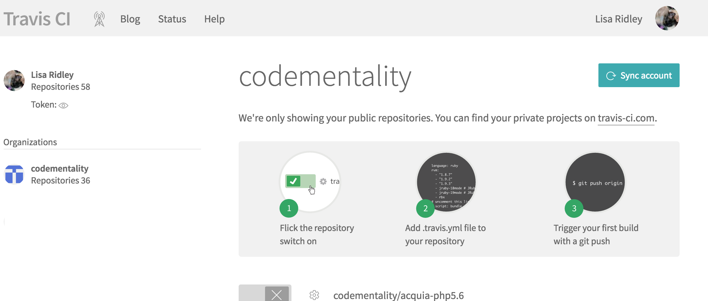

Lesson 10:  Configure Travis for Testing
========================================

If you've adopted and incorporated testing into your development process on client projects, testing can be facilitated with a continuous integration environment such as Travis CI.  Through its integration with Github, Travis can be set up for your projects to automatically start a build based on the settings you choose for your project, and the instructions you include in a file in your repository named `.travis.yml`.

When we initialized our drupal site back in Lesson 7, one of the files that was created for us was this Travis build file.  Let's look at it now.

Open `.travis.yml` in your editor.  You should see something similar to:

.. code-block:: yaml
   :linenos:
   :emphasize-lines: 14

    language: ruby
    sudo: required

    services:
      - docker

    git:
      depth: 5

    before_install:
      - export PATH=$PATH:$HOME/.local/bin

    install:
      #- docker login -e="$DOCKER_EMAIL" -u="$DOCKER_USERNAME" -p="$DOCKER_PASSWORD"
      - make init

    before_script:
      - make update-tests

    script:
      # Drupal 8
      - make phpcs
      - make behat

This is a typical Travis build file for a Docker based project.  If you've configured Travis builds before you'll appreciate the simplicity of configuring a Travis build using a Docker based project.

You simply specify that you are using "docker" as a service, set a PATH variable before you start your installation, and then use the targets in your makefile to initiate the same build and test process you use when you create your local development environment.  In our case that is the "init" target.

For our "install" step on Travis, we are using the "init" target in our Makefile.

Before we execute our tests, we make sure that our testing environment is up to date.

Then in our "script" environment we execute two targets:

* make phpcs -- runs Drupal Coder on the directories we specified in our Makefile
* make behat -- runs the Behat test we have written in our "test" folder, which is included in our project source code repository.

We won't be covering Behat test in this class.  The specifics of writing Behat tests is beyond the scope of this exercise.  However, we have include a basic test suite to execute a handful of tests on our sample Drupal site for illustrative purposes to demonstrate how effortless it is to adopt testing as part of development, and to configure a Travis CI build process tied to this project.

.. Note::
    Note the commented line in our `.travis.yml` file under the "install" tag.  If you are building from a private repository on Docker Hub, Travis will have to authenticate a Docker Hub account with access to that repository before that image can be used for a Travis CI build.  You can set environment variables in Travis to house the credentials needed for authentication to Docker Hub, and uncomment this line so that Travis can authenticate accordingly.

Now we'll set up Travis to work with our project.

1:  Log into travis-ci.org and link to your Github project
##########################################################

Log into travis-ci.org using your Github account SSO that you set up when you created your Travis CI account as part of the prerequisites for this class.

Near the top of the left sidebar, you'll see a "+" link...click this to add a new project to your Travis CI account.

You'll be taken to a screen similar to this:

If your Github account is linked to multiple organizations, you will see them listed on the left, below your name.  Select the organization where your Github project repo  is located.  Page down until you find the "dockerdrop" project.  Toggle the switch to turn it "green" with a checkbox.  This activates your project on Travis.

2:  Configure your project for automated builds
###############################################

Now click on the gear icon next to the project name, you'll be taken to the settings page for that project.

Toggle the following:

* Build only if .travis.yml is present
* Build pushes
* Build pull requests

If you set up a private Docker Hub account you can add environment variables in the area below titled "Environment Variables".

.. Note::
    Note the "display value in build log" option.  If you are loading account credentials as environment variables, leave this toggled off; otherwise Travis will publish the credentials in plain text in the build logs.

Your project is now set up to execute an automated Travis build every time you make a commit to a branch, or generate a pull request on Github, provided you have a .travis.yml file in your repository.

Travis will use the same container images you are using in your local development environment to build a test environment and execute the test suites you have configured for your project.
