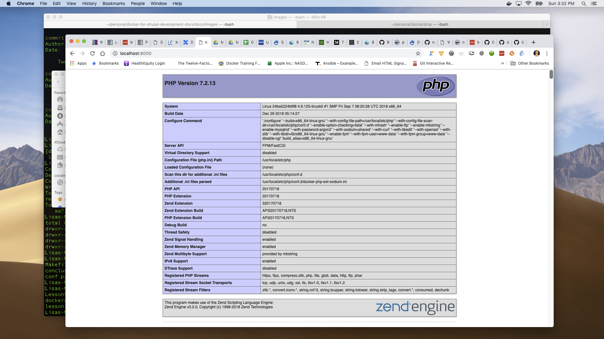

Lesson 3:  Add PHP, customize NginX
===================================

1: Add `web` folder with `index.php` to our project
###################################################

Let's get our project ready to serve up a PHP application.

Create a directory called `web` at the root of your project.  Inside that directory, create a file called `index.php` with the following contents:

.. code-block:: php
   :linenos:

    <?php
    phpinfo();

2: Add the php-fpm container configuration to `docker-compose.yml`
##################################################################

Open `docker-compose.yml` in your favorite editor and add the following lines for the PHP service under the `service` key:

.. code-block:: yaml
   :linenos:
   :emphasize-lines: 10-15

   version: '2'

   services:

     web:
       image: nginx:latest
       ports:
         - 8000:80

      php:
        image: php:7.0-fpm
        expose:
          - 9000
        volumes:
          - ./web:/var/www/html/web

Note that we are pinning our PHP container to version `7.0-fpm`.

The Official PHP images don't expose port 9000 by default, so we specify it ourselves in our configuration settings.

The difference between `expose` and `ports` is that `expose` lets you expose some ports to the other containers only, and `port` lets you make them accessible to the host machine.  In this case we are exposing port 9000 on the `php` container to the stack's internal network.

We have also added a `volumes` key to our PHP container configuration, which we are using to specify data volumes for the PHP container.  A data volume is a specially-designated directory within one or more containers that bypasses Docker's Union File System, which is the Docker file system that operates by creating layers.

Data volumes can be structured so that they are shared among containers, as well as configured to share directories with the host machine in certain circumstances, which is what we are doing here.  Similar to ports, shared volumes can be mapped in the following format:  `<host machine directory>:<container directory>`.

What we're saying here is that the current directory (designated with (`.`) ) must be mounted inside the container as its /var/www/html directory. To simplify, it means that the content of the current directory on our host machine will be in sync with the `/var/www/html` directory in our containers. It also means that this content will be persistent even if we destroy the container, since it resides in a directory on the host machine.

More on that later.

3. Add a custom nginx config file to your repository
####################################################

Now that we're adding another container to our stack, our two containers need to "talk" to each other.  We also need to change the default configuration of NginX so that it loads a config file better suited to handle all of the configuration settings needed for a Drupal application.

Create a file in the `docker/nginx` directory called `default.conf`, and put the following in it:

.. code-block:: javascript
   :linenos:
   :emphasize-lines: 87

    # Let's redirect https requests to http; you'll want to modify this if you
    # need to test over https

    server {
        listen 443;
        listen [::]:443;

        return 302 http://$server_name$request_uri;
    }

    server {
        server_name SERVER_NAME;

        listen 80 default_server;
        listen [::]:80 default_server;

        root /var/www/html;
        index index.html index.php;

        charset utf-8;

        location / {
            try_files $uri $uri/ /index.php?$query_string;
        }

        location = /favicon.ico {
            log_not_found off;
            access_log off;
        }

        location = /robots.txt {
            allow all;
            log_not_found off;
            access_log off;
        }

        access_log off;
        error_log  /var/log/nginx/error.log error;

        sendfile off;

        client_max_body_size MAX_BODY_SIZE;

        location ~ \..*/.*\.php$ {
            return 403;
        }

        location ~ ^/sites/.*/private/ {
            return 403;
        }

        # Allow "Well-Known URIs" as per RFC 5785
        location ~* ^/.well-known/ {
            allow all;
        }

        # Block access to "hidden" files and directories whose names begin with a
        # period. This includes directories used by version control systems such
        # as Subversion or Git to store control files.
        location ~ (^|/)\. {
            return 403;
        }

        location @rewrite {
            rewrite ^/(.*)$ /index.php?q=$1;
        }

        # Don't allow direct access to PHP files in the vendor directory.
        location ~ /vendor/.*\.php$ {
            deny all;
            return 404;
        }

        # In Drupal 8, we must also match new paths where the '.php' appears in
        # the middle, such as update.php/selection. The rule we use is strict,
        # and only allows this pattern with the update.php front controller.
        # This allows legacy path aliases in the form of
        # blog/index.php/legacy-path to continue to route to Drupal nodes. If
        # you do not have any paths like that, then you might prefer to use a
        # laxer rule, such as:
        #   location ~ \.php(/|$) {
        # The laxer rule will continue to work if Drupal uses this new URL
        # pattern with front controllers other than update.php in a future
        # release.
        location ~ '\.php$|^/update.php' {
            fastcgi_split_path_info ^(.+?\.php)(|/.*)$;
            fastcgi_pass php:9000;
            fastcgi_index index.php;
            include fastcgi_params;
            fastcgi_param SCRIPT_FILENAME $document_root$fastcgi_script_name;
            fastcgi_param HTTP_PROXY "";
            fastcgi_param SCRIPT_FILENAME $document_root$fastcgi_script_name;
            fastcgi_param PATH_INFO $fastcgi_path_info;
            fastcgi_intercept_errors on;
            fastcgi_buffer_size 16k;
            fastcgi_buffers 4 16k;
        }

        # Fighting with Styles? This little gem is amazing.
        # location ~ ^/sites/.*/files/imagecache/ { # For Drupal <= 6
        location ~ ^/sites/.*/files/styles/ { # For Drupal >= 7
            try_files $uri @rewrite;
        }

        # Handle private files through Drupal.
        location ~ ^/system/files/ { # For Drupal >= 7
            try_files $uri /index.php?$query_string;
        }

        location ~* \.(js|css|png|jpg|jpeg|gif|ico)$ {
            expires max;
            log_not_found off;
        }

        location ~ /\.ht {
            deny all;
        }
    }

Save this file.

Note the highlighted line above, number 87:

    fastcgi_pass php:9000;

This defines the proxy PHP service for NginX as "php:9000", which means that NginX will pass all HTTP requests to the service identified with the domain name "php", to port 9000 on that service.

When Docker Compose passes statements to Docker to build this stack, Docker will set up a private network for the running containers in the stack, will set up a DNS service to map each service defined in the `docker-compose.yml` file to an IP address on that network, and each container on that network will be identified by the service tag from the `docker-compose.yml` file used to define that container.

NginX, as a running container on the Docker network, will look for a domain name of "php" in the DNS services available to it, starting with the private network set up by Docker, will resolve that domain name to its associated IP address, and will communicate with that service through the designated port.  NginX doesn't know or care that PHP is running in a docker container.  If the domain alias is not found in the internal network, Docker will next look to Google DNS, or the next level of DNS available on the network.

.. Note::

    Docker does not recognize DNS entries in the host's `/etc/host` file when resolving domain names and aliases.

4. Create a custom NginX container
##################################

We're going to create a custom NginX container image to replace the image we're currently using, and modify the NginX container to load the newly added config file

By default, the "official" NginX container uses the default configuration file that gets installed when NginX is installed.  We can, however, create our own container that loads the configuration file we just created.

Create a file called `Dockerfile` in the `docker/nginx` directory, and put the following in it:

.. code-block:: yaml
   :linenos:

    FROM nginx:1.10.3

    MAINTAINER Lisa Ridley "lhridley@gmail.com"

    COPY ./default.conf /etc/nginx/conf.d/default.conf

    # Add entrypoint script
    COPY docker-entrypoint.sh /usr/local/bin/
    RUN chmod a+x /usr/local/bin/docker-entrypoint.sh

    ENTRYPOINT /usr/local/bin/docker-entrypoint.sh

What we are doing here is creating a custom Docker container that is based on the nginx:1.10.3 container.  We are tagging ourselves as the maintainer, and we specify that we want to copy our `default.conf` file over the one supplied by NginX.

We are also adding a custom entrypoint script, which we'll create in a minute.

That was easy enough.

Now, to use the container we just defined, we need to modify our `docker-compose.yml` file, so open it in your editor and replace this line:

.. code-block:: yaml
   :linenos:

    image: nginx:1.10.3

with this:

.. code-block:: yaml
   :linenos:

    build: ./docker/nginx/

We've basically just instructed docker-compose to build a web container from the Dockerfile we defined when we start our stack, and provided the location of that Dockerfile.

Now, let's add some environment variables for our NginX container.  These values will be used by our entrypoint script, which we'll define in a moment.  Add the following to your `docker-compose.yml` file under the `web` service tag:

.. code-block:: yaml
   :linenos:

    environment:
      NGINX_DOCROOT: www/web
      NGINX_SERVER_NAME: localhost
      # Set to the same as the PHP_POST_MAX_SIZE, but use lowercase "m"
      NGINX_MAX_BODY_SIZE: 16m

Now, we need to share the volume from our PHP container with our NginX container so that it knows what to serve up when it starts.  Modify your web service in your docker-compose file to read as follows:

.. code-block:: yaml
   :linenos:

    web:
      build: ./docker/nginx/
      ports:
        - "8000:80"
      volumes_from:
        - php
      depends_on:
        - php

We're basically telling docker-compose that our web container is sharing the volumes that the PHP container has associated with it, and that our web container is dependent upon our PHP container.  What docker-compose will do is start the php container first before it starts the web container, so that the volumes shared from the PHP container are available to the web container when it starts.

5. Add an entrypoint script to the NginX container image
########################################################

In the `docker/nginx` folder, create a file named `docker-entrypoint.sh` and add the following to it:

.. code-block:: bash
   :linenos:

    #!/bin/bash

    set -eo pipefail

    # Configure docroot.
    if [ -n "$NGINX_DOCROOT" ]; then
        sed -i 's@root /var/www/html;@'"root /var/www/html/${NGINX_DOCROOT};"'@' /etc/nginx/conf.d/*.conf
    fi

    # Ensure max_body_size is defined, and configure client_max_body_size
    if [ -z "$NGINX_MAX_BODY_SIZE" ]; then
        NGINX_MAX_BODY_SIZE=8m
    fi
    sed -i 's/MAX_BODY_SIZE/'"${NGINX_MAX_BODY_SIZE}"'/' /etc/nginx/conf.d/*.conf

    # Ensure server name defined, and set the server_name
    if [ -z "$NGINX_SERVER_NAME" ]; then
        NGINX_SERVER_NAME=localhost
    fi
    sed -i 's/SERVER_NAME/'"${NGINX_SERVER_NAME}"'/' /etc/nginx/conf.d/*.conf

    exec "$@"

Let's take a look at the entrypoint script for a minute.

Notice the three "if" statements...what we are doing here is taking the environment variables stored in `$NGINX_DOCROOT`, `$NGINX_MAX_BODY_SIZE`, and `$NGINX_SERVER_NAME`, and using them if they exist to replace values in our `default.conf` file.

These correspond with the `environment` variables in our `docker-compose.yml` file.

6. Reload all containers in your stack
######################################

Issue the following commands:

    docker-compose down
    docker-compose up -d

...and navigate to `localhost:8000`.  You should see information about your PHP web installation, as follows:

At this point your docker-compose.yml file should look as follows:

.. code-block:: yaml
   :linenos:

    version: '2'

    services:

      web:
        build: ./docker/nginx/
        ports:
          - "8000:80"
        volumes_from:
          - php
        depends_on:
          - php
        environment:
          NGINX_DOCROOT: web
          NGINX_SERVER_NAME: localhost
          # Set to the same as the PHP_POST_MAX_SIZE, but use lowercase "m"
          NGINX_MAX_BODY_SIZE: 16m

      php:
        image: php:7.0-fpm
        expose:
          - 9000
        volumes:
          - ./web:/var/www/html/web
